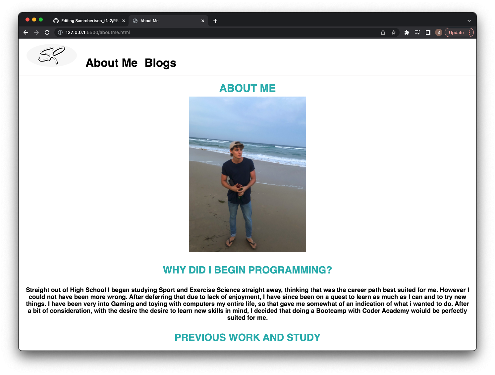

# Samrobertson_t1a2

[Github Repository](https://github.com/samrobertson-creator/Samrobertson_t1a2)
[Website] (<https://sam-robertson-542-portfolio.netlify.app>)
[SlideDeck](https://youtu.be/9AIBkkHTUaA)

## Purpose

The purpose of this website is to show my newly acquired skills as a web developer

## Layout

The layout of my portfolio, was designed to be minimanlist, however easy to navigate.

- Nav Bar: Provides navigation links to other pages on my website, as well as my logo being used as an anchor to take you back to the home page. Nav Bar is consistent throughout every page.
- Footer: Contains links to my LinkedIn profile as well as my GitHub account. Links can be accessed by clicking on the respective images
- Homepage: Contains a photo of myself so viewers can put a face to the name. Provides a link to my "About me" page, as well as my contact details
- About me: Contains another image of me. As well as this it contains more basic information about myself, such as why I began programming. Also has detail about my previous work experience as well as a link to my resume.
- Blogs: Provides links to all of my blog posts. Each individual blog has an anchor to take you back to main blog page. They also have an anchor at the bottom to take you to the top of the blog, in case you're wanting to read over it again.

## Site Map

Each page is linked to the nav bar at the top. 5 unique blogs are accessible from the blog page.

## Screenshots

### Homepage

### About Me

### My Blogs

### Blog Example

### Resume Link

## Target Audience

The target audience for this website is for potential employers.

## Tech

Made entirely from HTML and CSS and hosted on Netlify.
